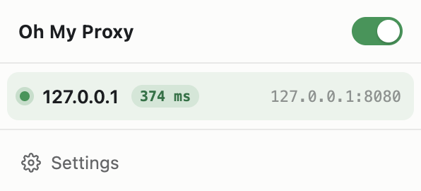
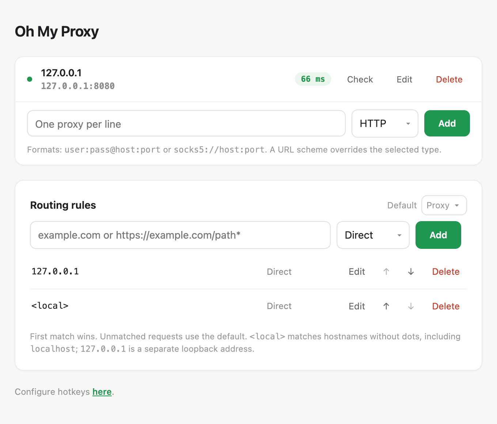

# Oh My Proxy

Fully local proxy control for Chrome and Firefox.

## What it can do

- Manage HTTP, HTTPS, and SOCKS5 proxies.
- Turn the selected proxy on or off from the popup.
- Check proxy reachability and response time.
- Switch proxies with keyboard shortcuts.

## Limitations

- Chrome does not support SOCKS5 usernames and passwords; Firefox does.
- Proxy passwords are stored locally but are not encrypted by the extension.
