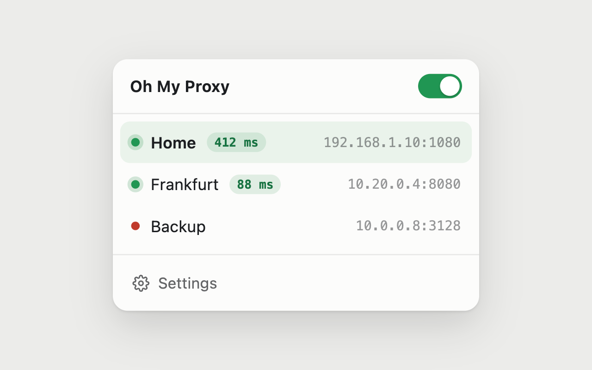
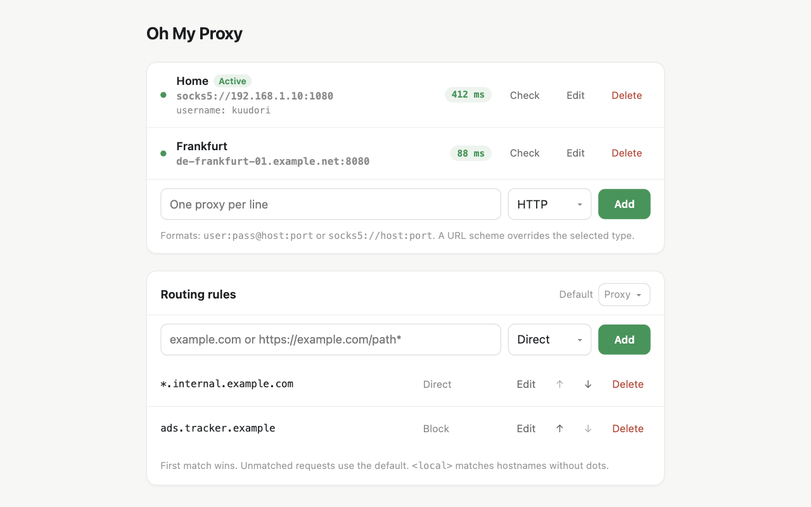

  

  

I got tired of proxy extensions that were too limited or too complicated, so I built my own.

## What it can do

- Manage HTTP, HTTPS, and SOCKS5 proxies.
- Turn the selected proxy on or off from the popup.
- Check proxy reachability and response time.
- Route sites directly, through a proxy, or block them.
- Switch proxies with keyboard shortcuts.

## Limitations

- Chrome does not support SOCKS5 usernames and passwords; Firefox does.
- Proxy passwords are stored locally but are not encrypted by the extension.
